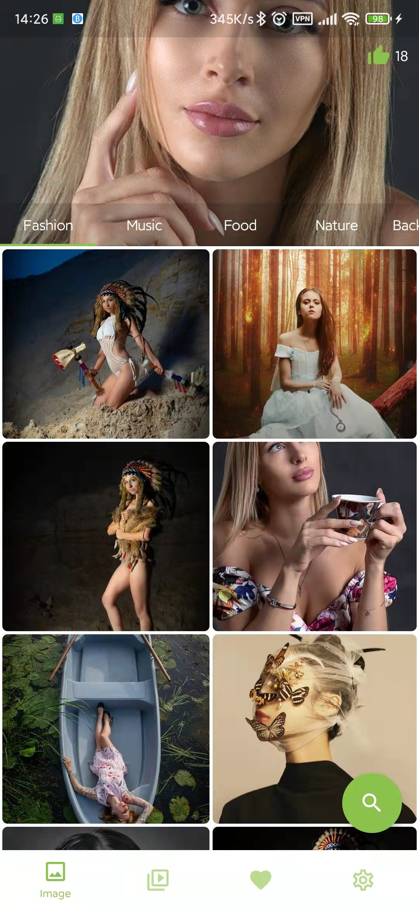

# fPix

a project where I practiced Flutter myself, I will get image of https://pixabay.com for presentation.

It's pretty easy now. Keep trying.

# cPix

a project where I practiced compose myself, I will get image of https://pixabay.com for presentation.

It's pretty easy now. Keep trying.